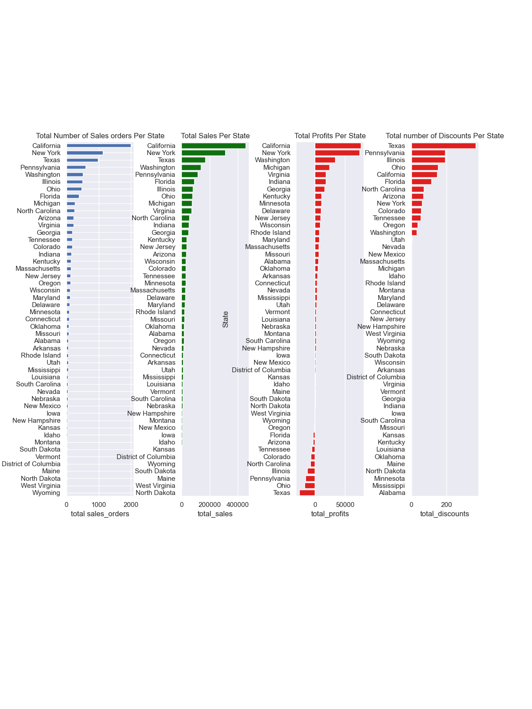
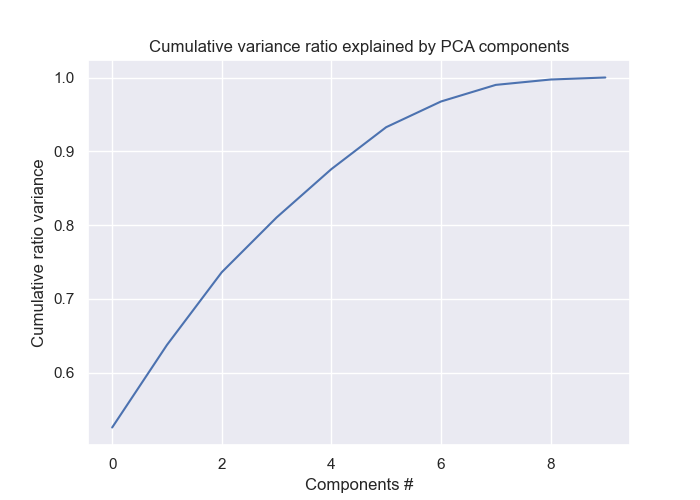

Understanding Superstore's Sales data using EDA
======================================================
  

# 1. Introduction

With growing demand in the market, a Supertore giant likes to have a better understanding of what factors matter to the sales and profits, accordingly to improve the forthcoming sales stragety.

The dataset is from [Kaggle](https://www.kaggle.com/datasets/vivek468/superstore-dataset-final) and was collected between Jan. 2014 and Jan. 2018.

The capstone project contains four parts: data cleaning, exploratory data analysis, preprocessing, final model selection and prediction.

# 2. Data Cleaning and Wrangling

  

# 3. Exploratory Data Analysis

  

**Heatmap gives us a sense of the important features to the profits**
  

**Words heavily involoved in product names**
  

  
 

# 4. Preprocessing 
  

**The first two components account for about 60% of the variance, and the first five for over 85%.**   
  

The blue points represent the upper quartile of 'profit' and spread across the first dimension (>0).

# 5. Training and Modeling

