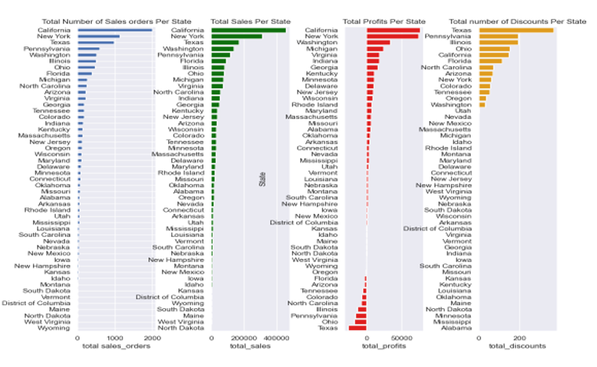
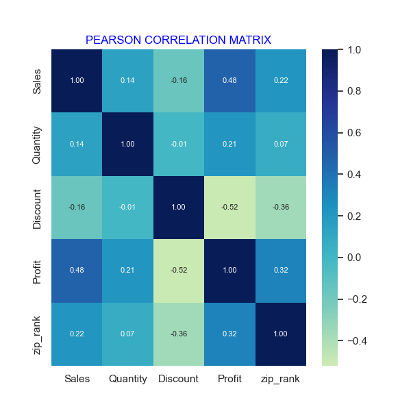

Understanding Superstore's Sales data using EDA
======================================================
  

# 1. Introduction

With growing demand in the market, a Supertore giant likes to have a better understanding of what factors matter to the sales and profits, accordingly to improve the forthcoming sales stragety.

The dataset is from [Kaggle](https://www.kaggle.com/datasets/vivek468/superstore-dataset-final) and was collected between Jan. 2014 and Jan. 2018.

The capstone project contains four parts: data cleaning, exploratory data analysis, preprocessing, final model selection and prediction.

# 2. Data Cleaning and Wrangling

# 3. Exploratory Data Analysis

Distribution of total profits per region  

Distribution of total postive profits per region  

Distribution of total negative profits per region  

**Heatmap gives us a sense of the important features to the profits**
  

We can see 'the number of discounts' becomes the MOST important contributor to profit.

  

  
 
Through the wordcloud generated images, we can see:

"xerox" and "ring binder" are the two most important words that were repeatedly mentioned in the product names. This is not very surprising since we found out 'office supplies' has the largest volumes of orders.
Two band names that stand out from this analysis are "newell" and "wilson jones', Newell Brands is an American worldwide manufacturer of consumer and commercial products with a portfolio of brands including: Rubbermaid storage, home organization and writing instruments, etc. Wilson Jones is the inventor and supplier of the three ring binder.
'conference table' and 'task chair' could imply that the volume of profits came from the category of 'furniture'.

# 4. Preprocessing 
  

**The first two components account for about 60% of the variance, and the first five for over 85%.**   
  

The blue points represent the lower quartile of 'profit' and spread across the first dimension (>0).

# 5. Training and Modeling

